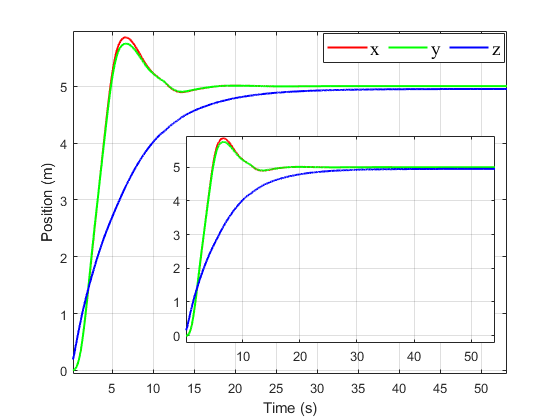
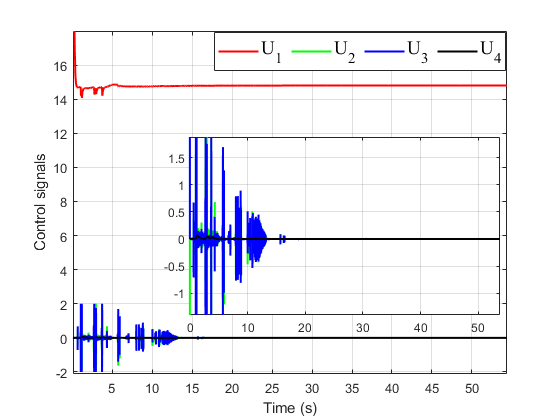
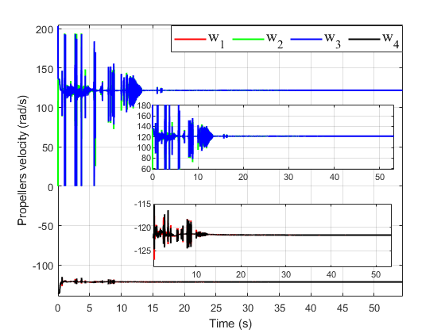
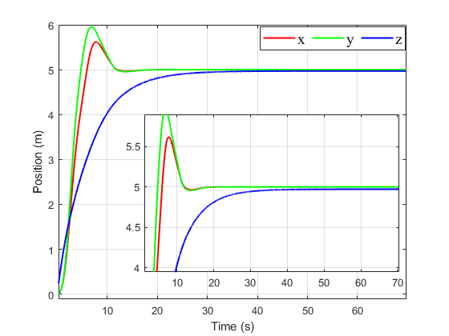
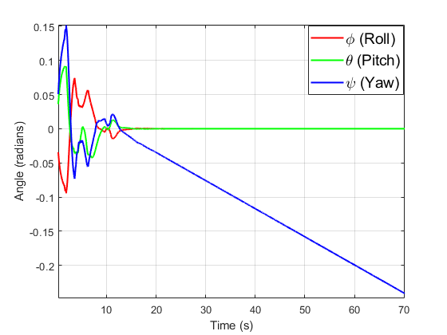
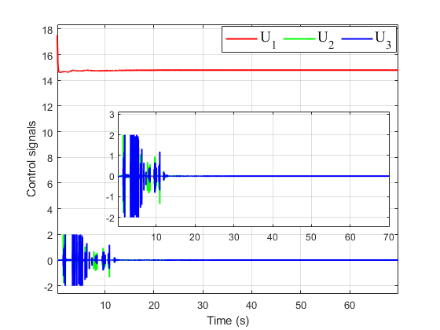
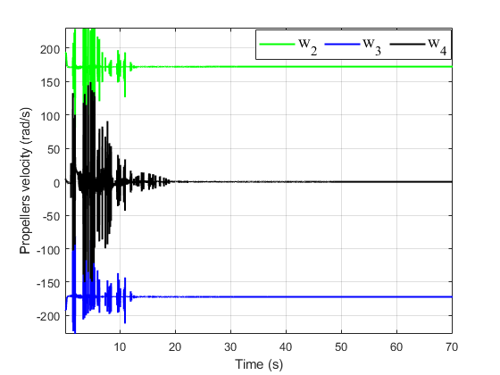

# AHSMC_EKF_Fault_Tolerant-for-Quadrotors-UAVs-on-Gazebo-ROS-2
This repository provides a methodology for controlling Quadrotor Unmanned Aerial Vehicles (UAVs) on Gazebo/Ros 2 Humble

## Software Requirements & Setup

The custom controller is designed in:

- Ubuntu 22.04
- ROS2 Humble
- Gazebo 11
- Xarco-ROS-Humble (sudo apt install ros-humble-xacro)
- Gazebo_ros_pkgs (sudo apt install ros-humble-gazebo-ros-pkgs)

Follow these commands to install the package:

```shell
# Step 1: Create and build a colcon workspace:
$ mkdir -p ~/dev_ws/src
$ cd ~/dev_ws/
$ colcon build
$ echo "source ~/dev_ws/devel/setup.bash" >> ~/.bashrc

# Step 2: Clone this repo into your workspace
$ cd ~/dev_ws/src
download the folder ahsmcekf in the main branch

# Step 3: Build the colcon workspace for this package
$ cd ~/dev_ws
$ colcon build
```
This project uses a custom plugin. Users need to update the plugin path in the file /urdf/uav_drone.urdf.xacro at line 268. Replace: filename="/home/vanchung/dev_ws/install/ahsmcekf/lib/ahsmcekf/libuavplugin.so" with the correct path by changing vanchung to the name of your computer. Then rebuild the project again to run the simulation.

# Contents
This section shows how to run the simulation and the results of the **PID controller**, **AHSMC controller**:

## a. **PID controller:**   

Follow these commands in order to run the PID simulation:

```
# run ros model
ros2 launch ahsmcekf model.launch.py
# start the EKF
ros2 run ahsmcekf EKFnode
# start the PID controller
ros2 run ahsmcekf pidcontroller
```
The video of the PID controller: 


https://github.com/user-attachments/assets/d6fd75c5-722c-4749-963c-0a49ffcab089


The simulation results of the PID controller: 

<p align="center">
    
    
</p>


<p align="center">
    
    
</p>


## b. **AHSMC controller:**   

Follow these commands in order to run the AHSMC simulation:

```
# run ros model
ros2 launch ahsmcekf model.launch.py
# start the EKF
ros2 run ahsmcekf EKFnode
# start the PID controller
ros2 run ahsmcekf ahsmc
```
The video of the AHSMC controller: 


https://github.com/user-attachments/assets/0402e2bc-0009-4fa9-8410-a9b1c4d000ea


The simulation results of the AHSMC controller: 

<p align="center">
    
    
</p>


<p align="center">
    
    
</p>

# Fault Tolerant controller for the Quadrotor UAVs
This section shows how to run the simulation and the fault-tolerant of the Quadrotor:

Follow these commands to install the package:

```shell
# Step 1: Create and build a colcon workspace:
$ mkdir -p ~/dev_ws/src
$ cd ~/dev_ws/
$ colcon build
$ echo "source ~/dev_ws/devel/setup.bash" >> ~/.bashrc

# Step 2: Clone this repo into your workspace
$ cd ~/dev_ws/src
download the folder ahsmcmotorfailure in the main branch

# Step 3: Build the colcon workspace for this package
$ cd ~/dev_ws
$ colcon build
```

Follow these commands in order to run the fault-tolerant simulation:

```
# run ros model
ros2 launch ahsmcmotorfailure model.launch.py
# start the EKF
ros2 run ahsmcmotorfailure EKFnode
# start controller
ros2 run ahsmcmotorfailure ahsmcmotorfailure

```
The video of the controller: 


https://github.com/user-attachments/assets/5ab21d7f-6e5f-4760-8d93-c2ff7ca8c9e6

The simulation results of the fault-tolerant simulation: 

<p align="center">
    
    
</p>


<p align="center">
    
    
</p>

# Contact
- [Van Chung Nguyen](mailto:vanchungn@.unr.edu)
- [Hung La](mailto:hla@unr.edu)
